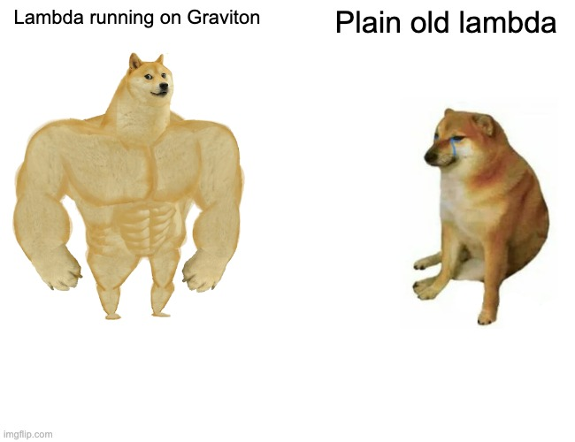

_This article is part of a series on [Guardian](https://www.npmjs.com/package/@kumo-by-theodo/guardian), an open-source, highly configurable, automated best-practice audit tool for AWS serverless architectures._

When I first started working on Guardian, I realized that AWS was releasing super cool features at an incredible speed but that an important number of them would go unnoticed by developers. This is especially the case for new options that can not be set by default to avoid breaking changes on AWS APIs. One of them is the introduction in 2021 of the new Graviton2 processor architecture in the AWS ephemeral compute service: Lambda. If you don't want to miss out on the performance, sustainability and cost saving, keep on reading!



## Use the latest infrastructures for your Lambdas: Graviton processors

The X86 architecture is widely adopted in the computer science field and is the go-to choice when it comes to computers and servers hardware. Yet, in the last couple of years, ARM have seduced more than one. AWS is one of the early adopters of ARM architecture in their on-demand cloud computing offer. In 2018, they unveiled their Graviton processors using 64-bit ARM chips for their compute offering stream (AWS EC2). In 2021, AWS Lambda followed up and now AWS Lambda followed up and functions could also be powered by AWS Graviton2 processor. Now, AWS Graviton3 processors are the latest in the AWS Graviton family and is ready to use on EC2.

## Improve your performance with ARM based technology

The family of processors has brought revolution by hardware as it offers reduced costs and latency while increasing performance and scalability.

### Think performance

Graviton2 has shown impressive performance improvements in comparison to the X86 processor family, this is especially the case with higher loads and concurrencies. Though it is difficult to assign an overall improvement percentage, it is undeniable that using ARM processors will definitely boost your app's performance. Graviton3 is previewed to give 25% performance improvement to the previous graviton2 according to AWS. ARM also provides more predictable performance with less latency and disruptions.

### Think sustainability

Your software projects —serverless or not— ultimately run on hardware and as your projects continue to grow, so does the reliance on and the use of the hardware. A 64-bit ARM core undertakes operations faster than x86_64: the task gets done quicker, and then the chip shuts down. Using an ARM architecture, you are guaranteed to reduce your carbon footprint.

### Think costs

A quicker run time rhymes with saving costs. [RedPanda](https://redpanda.com/blog/aws-graviton-2-arm-vs-x86-comparison), a streaming platform for mission-critical workloads, measured key performance metrics using the storage intensive workload platform as a target application. The results show a 20% price to performance advantage with Graviton2 compared to x86.

## Specify your Architecture

The AWS Lambda service offers the possibility to use the AWS Graviton2 processor. By default, architecture is set to x86_64 to avoid breaking changes as it was the only available option up to a year ago. That is why you should specify the architecture in your lambda.

Switching all functions to AWS Graviton2 processor is easily done by specifying the architecture at the provider level whether you're using serverless-framework, cdk, san, sst or any other. With serverless-framework for example, you'll have to modify your serverless.ts as follows:

````text
```ts
// code/demo-code.ts
```
````

Only one line of code to add and huge benefits.

You can (almost) always migrate your project from previous x86_64 to ARM64. Here is a [link](https://docs.aws.amazon.com/lambda/latest/dg/foundation-arch.html#foundation-arch-adv) to the AWS documentation with migration instructions for Lambda Functions.

## Easily monitor Lambda Functions Architecture with Guardian 🛡️

[Guardian](https://www.npmjs.com/package/@kumo-by-theodo/guardian) now offers a **new rule** guiding you to specify the architecture of your lambda functions.

Guardian also comes with **many other rules** to help you make the best decisions for your Serverless project. It will help you identify where your deployed resources can be optimized to achieve better performance at a lower cost.

### Guardian how-to

```
npm install @kumo-by-theodo/guardian
npx guardian -p <your_aws_profile> -c <your_stack_name>
```

Guardian is available on [NPM](https://www.npmjs.com/package/@kumo-by-theodo/guardian). You will find instructions to use Guardian in your CI.

## See also

Switching your apps architecture to ARM64 is a great step into making serverless sustainable. You can find more actions to take to make your apps even greener in this [article](https://dev.to/kumo/you-thought-serverless-was-green-here-is-how-to-really-make-it-sustainable-1m0p) by Charles for [Kumo](https://dev.to/kumo). Of course, guardian is watching over you, so [open an issue](https://github.com/Kumo-by-Theodo/guardian) or leave a comment below if you think of any new rule to keep track of!

```

```
