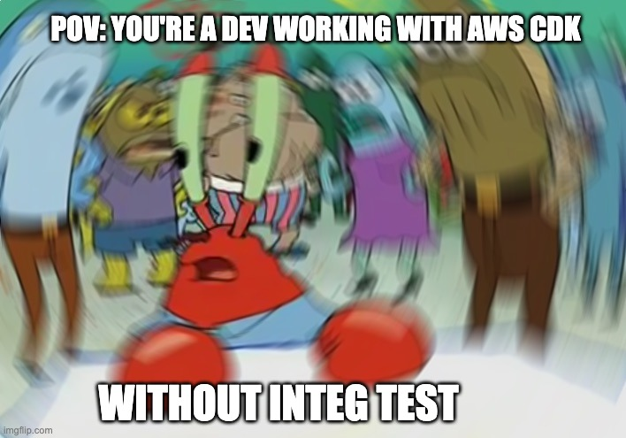
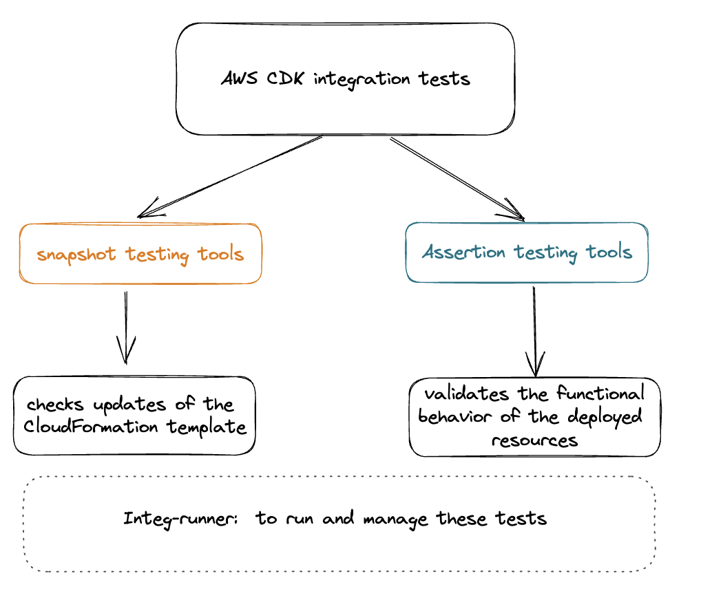
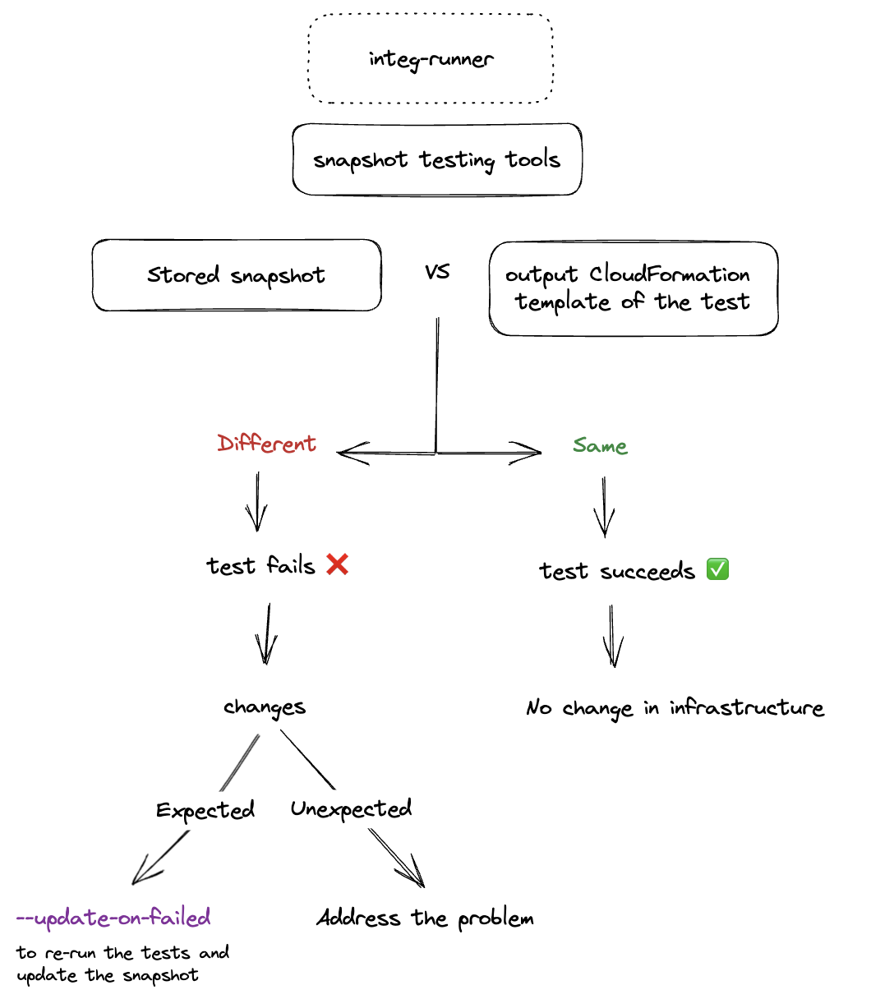
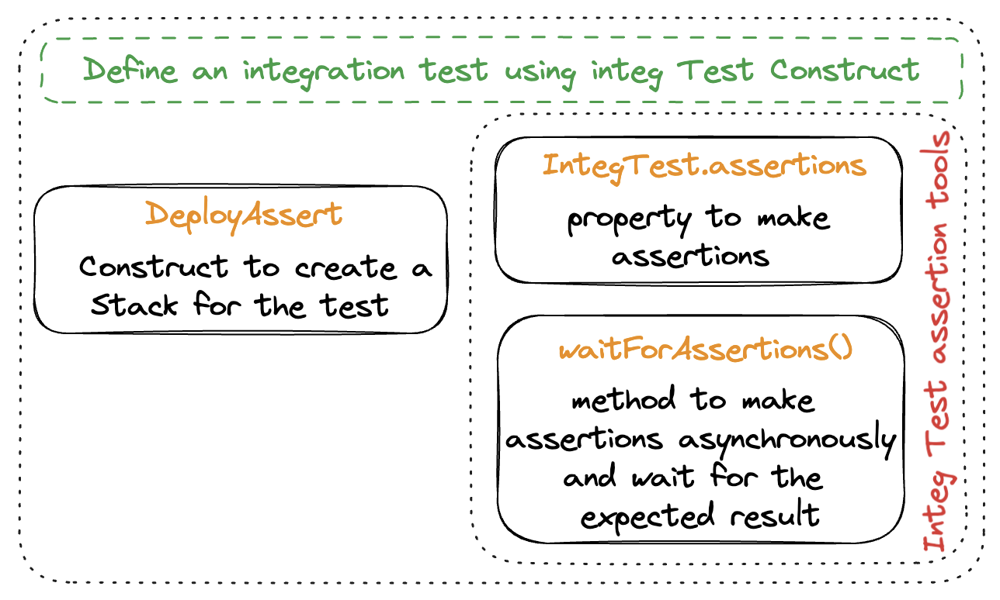
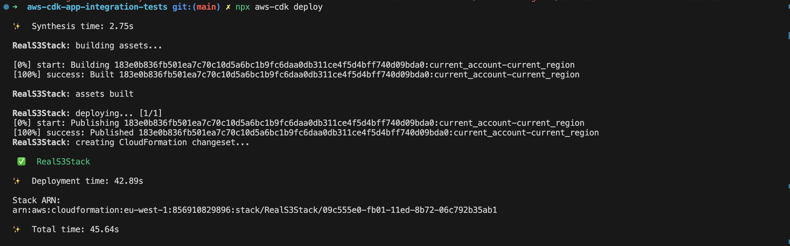
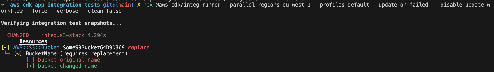
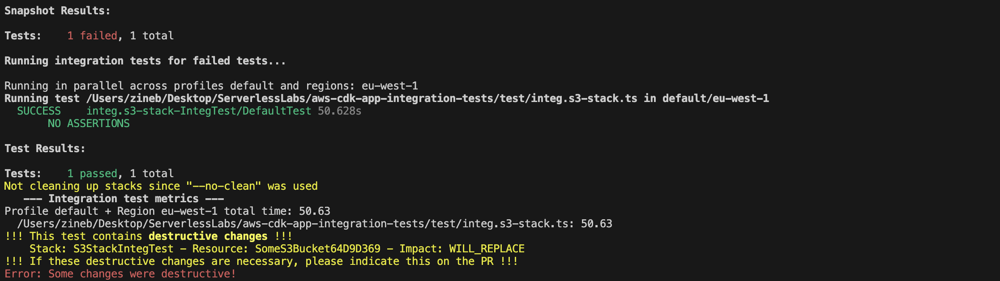
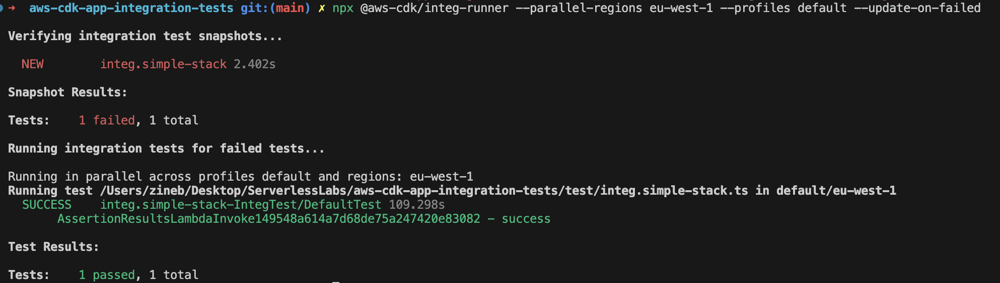

Do you ever get frustrated testing your infrastructure and resources behavior only to discover errors after deployment? As a developer, I feel your pain. More so when knowing how an essential aspect of software development testing is and how a complex and time-consuming task it can be ! Enter integ-runner and aws-cdk integ-test library – two powerful testing tools developed by AWS CDK that streamline the testing process.

In this article, I'll walk you through a CDK App example repository that illustrates how to implement and use these tools. By the end, you'll have a clear understanding of how AWS CDK integration tests can help you build better infrastructure with less stress!



## Do I still need to convince you of the overall value of integration tests ?

You can use unit tests to check that your dynamoDb Table or Lambda Function is correctly set, but you can't use unit tests to check that your dynamoDb Table and your lambda interact correctly with each other. That's what integration tests are for. And as nothing is more self-explainatory than a meme:


## Use the latest tools to test your AWS CDK constructs

Let's say your developing a CDK app or library. As your are working on building your constructs, at each development step, two questions are raised :

- Did I mess up my infrastructure without realizing?
- My infrastructure is fine but does everything that worked still work as expected?

In the context of AWS CDK integration tests, there are two types of tests that you might encounter and that will bring you answer: snapshot tests and assertion tests.

Snapshot tests are useful to check your cloufromation templates whereas assertion tests are useful for testing the behavior of the deployed resources.



We will be using IntegTest library to define our integration tests. Then we will be using integ-runner in order to run and manage these tests.

## Let's dive into our testing tools

Once our test file is declared with Integ Test, Integ runner works in two parts. The first part concerns the snapshots while the second one concerns the assertions if there are any.

### Snapshot testing

Here is the snapshots decision tree:



To re-run the integration test for the failed tests you would then run:

`integ-runner --update-on-failed`

This will run the snapshot tests and collect all the failed tests. It will then re-execute the integration test for the failed tests and if successful, save the new snapshot.

Snapshots testing are quite common (e.g with react components) and are often overlooked by developpers when automatically using the --update-on-failed option. While developping with CDK, the importance given to snapshots are on another dimension as we will see later on.

### Assertion testing

<!-- Integ tests to define the tests in schema  -->

Assertion testing in the context of AWS CDK is used to test the behavior of deployed resources. Developers define an integration test using the IntegTest construct. Then using the different IntegTest tools, API calls are made and once the polling has timed out, we can check that the actions resulted in the expected events.

Fine-grained assertions can test specific aspects of the generated CloudFormation template, such as "this resource has this property with this value." The assertion constructs are used to make assertions on the infrastructure before the deployment is considered successful.

Assertion testing is important as it allows developers to ensure that the deployed resources behave as expected and can detect regressions.

Here is the general overview covering integ test and its assertion tools:



# Let’s set up our CDK app and its testing with IntegTest and integ-runner in typescript !

In this section, i'll be guiding you through the creation of your CDK app, setting it up with integ test & through multiple examples to illustrate the whole bunch of theory that was spit in the previous sections !

### Create your project

Let’s start from scratch by creating our CDK app project with the following command:

`npx aws-cdk init app --language typescript`

### Setting up integ test

Next, we are going to need to install Integ Test in our project:

`npm install @aws-cdk/integ-tests-alpha --save-dev`

You must have noticed the 'alpha' in the package name. IntegTest is still under development and breaking changes might occur in the incoming months so keep an eye open on the next AWS realeases.

Now we will create the test file in our test folder. Integ-runner looks for all files matching the naming convention of /integ.\*.js$/ in the test folder in the root (you can specify your own directory). Each test file is a self contained CDK app.

Now that we have all the theory that we need, let’s set up our first integration test with integ test !

## Writing your test with Integ Test

We need something to test, so in order to illustrate what was said before, we will set up 2 different stacks to test:

- A first one with a very simple lambda to set up a first test and to be reused later on for assertions
- A second one that is bound to fail tests with an s3 bucket

### Let's start simple

#### Setting up the stack

I have set up a very simple stack with a simple lambda:

```typescript
import * as cdk from 'aws-cdk-lib';
import path from 'path';
import { Construct } from 'constructs';
import * as lambda from 'aws-cdk-lib/aws-lambda';

export class SimpleStack extends cdk.Stack {
  constructor(scope: Construct, id: string, props?: cdk.StackProps) {
    super(scope, id, props);

    new lambda.Function(this, 'SimpleLambda', {
      runtime: lambda.Runtime.NODEJS_14_X,
      code: lambda.Code.fromInline('exports.handler = async function() { return "Hello, CDK!"; };'),
      handler: 'index.handler',
    });
  }
}
```

My stack only contains one resource which is a lambda that console logs "Hello, CDK !" when called. Simple, right ?

#### Testing that stack

We start by creating a new file named `integ.simple-lambda.ts` - which will be transpiled to `integ.simple-lambda.js` by the compiler - in your `test/` directory. This file will contain the CDK app for the integration test.

We import the required modules, create a new CDK app, and instantiate the `SimpleLambdaStack`as part of the app.

We then create an `IntegTest` instance, passing the instantiated stack as the single test case for this example:

```typescript
import { App } from 'aws-cdk-lib';
import { IntegTest } from '@aws-cdk/integ-tests-alpha';
import { SimpleStack } from '../lib/simple-stack';

const app = new App();
const simpleStack = new SimpleStack(app, 'SimpleStackIntegTest');

new IntegTest(app, 'IntegTest', {
  testCases: [simpleStack],
});

app.synth();
```

This testing file basically defines and sets up a stack ready for deployment. You could definitely use a simple `cdk deploy` for that but it doesn't provide built-in support for running multiple integration tests or handling snapshot updates. But no worries, let's use integ-runner !

As explained earlier in this article, `integ-runner` will deploy our test stack and will take care of handling snapshots and running integration tests for us. In order to do so, just run the following command: `npx integ-runner`


As you can see, our test has failed. More precisely, the snapshot testing has failed. That is no big news as we are making deliberate changes to our construct. We can therefore use the `--update-on-failed` option when launching integ-runner.

But wait, what am I testing here ? Where are the assertions that one expects in any type of test ?

Well, our test does not contain any assertion. As it is, it "only" tests the infrastructure.

Using integration tests without assertions can still serve valuable purposes, such as acting as a regression detector as you can detect any unintended changes in the infrastructure code. Additionally, integration tests can help ensure that the CDK application is deployable and that the eventual dependencies between the different infrastructure components are respected.

The next example is here just to illustrate these use cases !

### Let's make a (deliberate ?) breaking change !

I will now set up a stack with a single resource: some S3 bucket. At first my bucket name is `bucket-original-name` but let's say a developer decided to change the bucket name or just mistakenly did so.

As you might know, it is not possible to change the name of a bucket name in S3. For that you would need to actually create a new bucket and copy every file from that old bucket to your new bucket.

You can definitely run `aws-cdk deploy` without any issue and without any warning. You'll just end up with two buckets but the one you're pointing at now is empty and all the files are still stuck in the old one:



Whereas a simple integration test with Integ Test and with integ-runner will SCREAM and WARN you that this is actually a destructive change thanks to the snapshots. Of course, one can be pushed to make destructive changes throughout the development process but these changes often require some other actions to take place smoothly (if not at least warning your co-developers about this).

While aws-cdk deploy completely overlooks the problem, integ-runner really urges you to take some action and not let these changes under the hood.

Here is how integ-runner calls out such a change: 

And how it warns you of that: 

Pretty neat, heh ! But keep in mind that this is just a simple example, and there is a tremendous amount of issues that the integ-test could catch.

#### A quick word about test cases Integ Tests testCases

Imagine now you have a stack with a simple lambda but as props you accept different architectures: x86 or arm64.

```typescript
import * as cdk from 'aws-cdk-lib';
import path from 'path';
import { Construct } from 'constructs';
import * as lambda from 'aws-cdk-lib/aws-lambda';

type ArchitectureStackProps = {
  architecture: lambda.Architecture;
  props?: cdk.StackProps;
};
export class FlexibleArchitectureStack extends cdk.Stack {
  constructor(scope: Construct, id: string, { architecture, props }: ArchitectureStackProps) {
    super(scope, id, props);

    new lambda.Function(this, 'FlexibleArchitectureLambda', {
      runtime: lambda.Runtime.NODEJS_14_X,
      code: lambda.Code.fromAsset(path.join(__dirname, '../src')),
      handler: 'index.handler',
      architecture,
    });
  }
}
```

How can you make sure that your stack is resilient to both these infrastructures?

That's exactly what Integ Tests testCases attribute allows you to do. It can take as many constructs to test as you'll be able to provide.

Here we have two test cases with these two stacks each instantiated with a different architecture:

```typescript
const armStack = new FlexibleArchitectureStack(app, 'ArmStackIntegTest', {
  architecture: Architecture.ARM_64,
});

const x86Stack = new FlexibleArchitectureStack(app, 'X86StackIntegTest', {
  architecture: Architecture.X86_64,
});

new IntegTest(app, 'IntegTest', {
  testCases: [armStack, x86Stack],
});
```

Of course, you would be a fool to still run your lambdas on x86 unless constrained, but if you ever need a reminder on why not to do that, this [article](https://dev.to/kumo/that-one-aws-lambda-hidden-configuration-that-will-make-you-a-hero-guardian-is-watching-over-you-5gi7) will do you good.

If you need to test the same construct instantiated with different props (i.e different infrastructural choices/requirements), then `testCases` is there for you !

### Let's explore IntegTest with assertions

Getting back to our very first example of a stack with a simple lambda returning "Hello, CDK !". How can we make assertions on the resources that form our construct ?

Easy ! We have previously declared a new instance of the aws cdk class IntegTest. It offers an interface that allows for registering a list of assertions that should be performed on the construct.

On each resource of our construct, we can make API calls and once the polling has timed out, we can make expectations on the invocation result.

#### With Lambda

For lambdas, we can use the invokeFunction of IntegTest.assertions. The invocation response is then expected to match a certain object. In our case, we need the payload which is what is returned by the lambda to be "Hello, CDK!". The call has to be successful, hence the 200 status code.

```typescript
export const testSimpleStack = ({ integ }: AssertionTestInput) => {
  const simpleLambdaInvocation = integ.assertions.invokeFunction({
    functionName: 'simpleLambda',
    invocationType: InvocationType.REQUEST_RESPONE,
    payload: '',
  });

  simpleLambdaInvocation.expect(
    ExpectedResult.objectLike({
      StatusCode: 200,
      ExecutedVersion: '$LATEST',
      Payload: '"Hello, CDK!"',
    }),
  );
};
```

Here is what you might see on your terminal when your assertions are successful:



#### With other AWS services

Lambda is that one privileged service here that has a specific method within the Integ Test realm to be invoked: the IntegTest.assertion.invokeFunction. For the other services, we will have to call the service directly with `awsApiCall` and give it the adequate attributes.

This is the tricky part here is as you need to dig deep in the documentation (lien) to be sure of the input you give awsApiCall but also the response you'll get from it as it strongly depends on the service.

Here is a simple example with an SQS Queue that we could have added to our simple stack:

```typescript
const message = integ.assertions.awsApiCall('SQS', 'receiveMessage', {
  QueueUrl: 'url',
});
message.expect(
  ExpectedResult.objectLike({
    Messages: [{ Body: 'hello' }],
  }),
);
```

## Conclusion

My overall take is that these two tools are really covering a lot of blind spots that can potentially really ruin at least your developer experience and at worse your whole app.

However, there is a number of pretty big pain points that weren't addressed in this article. To cite a few:

- it's still in alpha version so you would need to be actively following the news around these tools;
- The awsApiCall's input and its response are quite cryptic for a lot of Services (trust me, I broke my teeth on this playing with StepFunctions) and you won't find a lot of examples sitting around;
- You'll have to be patient as you are actually deploying real stacks on AWS and that requires at least a few dozens of seconds. Repetitively waiting can bum you out at some point ~

As with any new technology, the amount of community support and documentation available for the **`aws-cdk integ-test-alpha`** package can impact its usefulness. If there is a lack of support, it may be more difficult to troubleshoot issues or to find helpful resources when working with the package. So how about all contributing to developing these awesome tools ?
