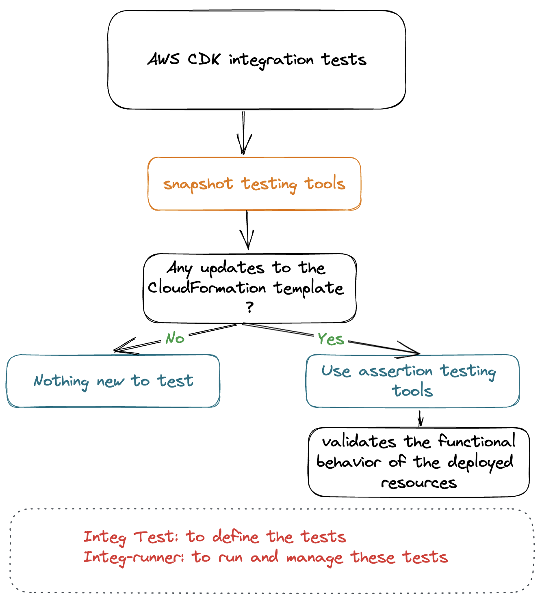
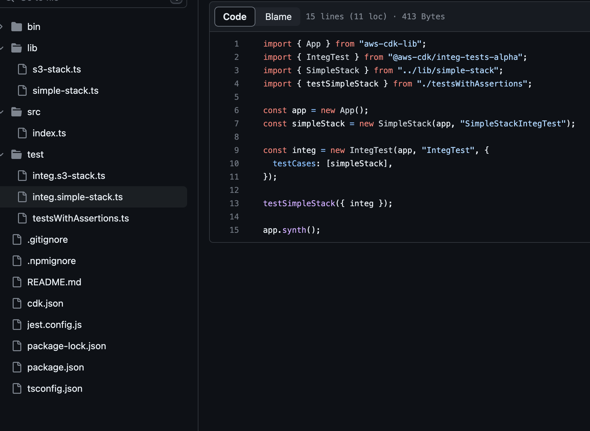
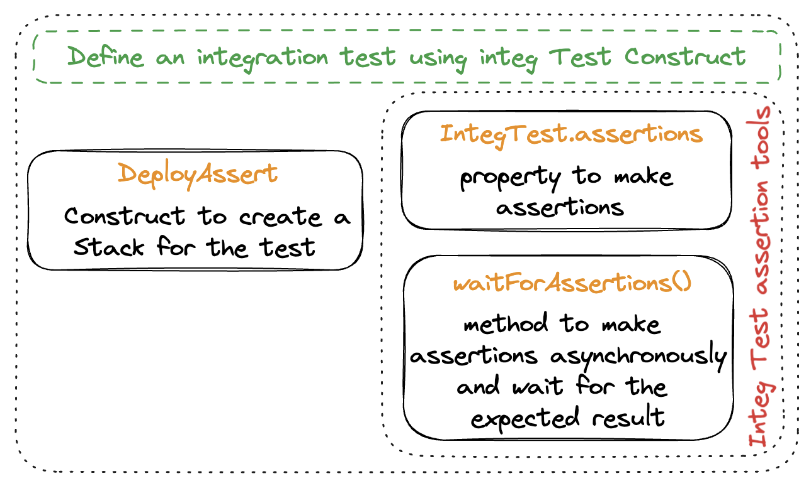

Do you ever get frustrated testing your infrastructure and resources' behavior, only to discover errors after deployment? 😫 As a developer, I feel your pain. Testing is an essential aspect of software development that can be complex and time-consuming. But fear not! AWS CDK offers two powerful testing tools - integ-runner and aws-cdk integ-test library - to streamline the testing process. 🧪🚀

_This article kicks off a series dedicated to integ-test. Here, we'll unravel the underlying principles of integ-test and delve into the theory surrounding tests. In the next article, I'll walk you through a CDK App example repository that illustrates how to implement and use these tools. By the conclusion of this series, you'll have a clear understanding of how AWS CDK integration tests can help you build better infrastructure with less stress! 🎉_

_Access the [Github repository](https://github.com/gozineb/aws-cdk-app-integration-tests) used in this series._

## Understanding the Value of Integration Tests

You can use unit tests to check that your DynamoDB table or Lambda function is correctly set, but you can't use unit tests to check if they interact correctly with each other. That's where integration tests come in. And as nothing is more self-explanatory than a meme:

## Harness the Latest Tools to Test Your AWS CDK Constructs

AWS Cloud Development Kit (CDK) enables developers to define cloud infrastructure as code using familiar programming languages like TypeScript. 👩‍💻🚀

As we develop a CDK app or library, two critical questions often arise at each phase:

1. Have I inadvertently introduced flaws in my infrastructure? 🤔
2. While my infrastructure seems fine, does everything that functioned earlier still operate as expected? 🧐

In the context of AWS CDK integration tests, there are two types of tests that can help answer these questions and that will bring you answer: snapshot tests and assertion tests. ✅🔍

Snapshot tests are useful for checking your CloudFormation templates, while assertion tests are designed to test the behavior of your deployed resources. Combined, they provide a comprehensive testing approach:

To write integration tests, we'll be utilizing the IntegTest library. Subsequently, we'll leverage integ-runner for running and managing these tests.

## Unpacking Our Testing Tools

Let's go on a Github repository adventure! Take a look at this [repo](https://github.com/gozineb/aws-cdk-app-integration-tests). Inside the 'tests' folder, you'll find our various integration tests:

This is an example of a typical test file, it includes the declaration of a new App, a new stack to feed to integ-test and as many assertion tests as required.

Once we declare our test file with integ-tests, we use `aws-cdk-lib/assertions` to add assertions, and then we run it with integ-runner! 🏃‍♀️🏃‍♂️

### Snapshot Testing

Snapshots allow you to avoid re-running all your tests every time. Here's how it works:

To re-run integration tests for failed tests, run:

`integ-runner --update-on-failed`

This will run the snapshot tests and collect all the failed tests. It will then re-execute the integration test for the failed tests. If successful, the new snapshot will be saved.

_Snapshot testing is quite common (e.g., [with react components using jest](https://jestjs.io/docs/snapshot-testing)). It is often overlooked by developers when they automatically use the `--update-on-failed` option._

### Assertion Testing

In AWS CDK, assertion testing is used to test the behavior of deployed resources. Developers define an integration test using the `IntegTest` construct. Then, using the different integ-test tools, API calls are made, and once the request has timed out, we can check that the actions resulted in the expected events.

By using `aws-cdk-lib/assertions`, we can add fine-grained assertions to test specific aspects of the generated CloudFormation template, such as "this resource has this property with this value." These assertions validate the infrastructure before the deployment is considered successful.

Here's an overview of integ-test and its assertion tools:

### Conclusion

Congratulations! 🎉 You now have a good understanding of the importance of integration testing in AWS CDK development and the available tools to harness the power of testing.

Stay tuned for the upcoming article, where you'll be guided through the process of becoming a proficient integration tester in the world of AWS CDK! ✨
