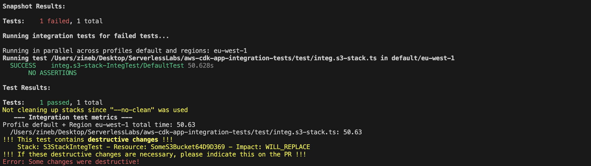

--- This is the 2nd article of the series. You can look at the first article here (url_of_the_article) to remember the theory behind what we are going to do next.

In this article, I'll walk you through a CDK App example repository that illustrates how to implement and use these tools. By the end, you'll have a clear understanding of how AWS CDK integration tests can help you build better infrastructure with less stress!


# Github Repo:

Link to the github repo: https://github.com/gozineb/aws-cdk-app-integration-tests

# Let’s set up our CDK app and test it with integ-tests in typescript !

In this section, I'll be guiding you through the creation of your CDK app, and setting it up with integ-test. To illustrate the process, let's consider two stacks: a simple Lambda setup and an S3 bucket designed to fail the tests.

## Kick-off your project

Start by creating your empty folder directory:

`mkdir myDirectory && cd myDirectory`

Next, initialize your CDK app project with the command:

`npx aws-cdk init app --language typescript`

## Setting up integ test

Next, we are going to need to install Integ Test in our project:

`npm install @aws-cdk/integ-tests-alpha --save-dev`

_You must have noticed the 'alpha' in the package name. integ-tests is still under development and breaking changes might occur in the incoming months so keep an eye open on the next AWS releases !_

## Writing your test with integ-tests

**Comment**: To illustrate the process, let's consider two stacks: a simple Lambda setup and an S3 bucket designed to fail the tests.: ça sert a rien de dire ça dans l'intro, on n'entend plus parler de la lambda et du bucket avant "Let’s set up our CDK app and test it with integ-tests in typescript !"

To illustrate the process, let's consider two stacks: a simple Lambda setup and an S3 bucket designed to fail the tests.

### Let's start simple

#### Setting up the stack

In the `lib` directory, I have set up a stack containing only one lambda which console log "hello worlds".

```typescript
import * as cdk from 'aws-cdk-lib';
import { Construct } from 'constructs';
import * as lambda from 'aws-cdk-lib/aws-lambda';

export class SimpleStack extends cdk.Stack {
  constructor(scope: Construct, id: string, props?: cdk.StackProps) {
    super(scope, id, props);

    new lambda.Function(this, 'SimpleLambda', {
      runtime: lambda.Runtime.NODEJS_14_X,
      code: lambda.Code.fromInline('exports.handler = async function() { return "Hello, CDK!"; };'),
      handler: 'index.handler',
    });
  }
}
```

My stack only contains one resource which is a lambda that console logs "Hello, CDK !" when called. Simple, right ?

#### Testing that stack

Once your stack is ready, create an integration test. Simply draft a new **`integ.simple-lambda.ts`** file in your **`test/`** directory.

Start by importing necessary modules and making a fresh CDK app. This app will contain an instance of our **`SimpleLambdaStack`**. Following this, generate an **`IntegTest`** instance, passing the stack as the only test case.

```typescript
import { App } from 'aws-cdk-lib';
import { IntegTest } from '@aws-cdk/integ-tests-alpha';
import { SimpleStack } from '../lib/simple-stack';

const app = new App();
const simpleStack = new SimpleStack(app, 'SimpleStackIntegTest');

new IntegTest(app, 'IntegTest', {
  testCases: [simpleStack],
});

app.synth();
```

This testing file basically defines and sets up a stack ready for deployment. You could definitely use a simple `cdk deploy` for that but it doesn't provide built-in support for running multiple integration tests or handling snapshot updates. But no worries, let's use integ-runner !

As explained earlier in this article, `integ-runner` will deploy our test stack and will take care of handling snapshots and running integration tests for us. In order to do so, just run the following command: `npx @aws-cdk/integ-runner`


You'll notice our test fails, specifically during snapshot testing, an expected result due to our deliberate construct alterations. The **`--update-on-failed`** option can address this when initiating integ-runner.

---

#### Take a look at your cloudformation 👀

If you take a look at your cloudformation, 2 stacks must have been created in the following order:

- **SimpleStackIntegTest**: This stack represents your actual stack that you want to test. It contains the resources and configurations defined in your integ-test file.
- **IntegTestDefaultTestDeployAssert...**: This stack is a temporary stack automatically created by integ-runner for the purpose of executing integration test using a custom resources. The custom resource allows you to validate the behavior of the deployed resources, and if the tests fail, CloudFormation triggers an automatic rollback of the stack.


---

At this juncture, you might question the absence of assertions, a usual test feature. This test is assertion-free, focusing on infrastructure testing.

Unorthodox as it may seem, assertion-less integration tests offer value. They act as regression guards, spotting unexpected code changes, and assure the CDK application's deployability and component coherence. With this, refactor fearlessly, knowing you're protected against surprises.

The following example demonstrates these points.

### Let's make a (deliberate ?) breaking change !

Let's consider a stack with a single resource, an S3 bucket named **`bucket-original-name`**. Now, suppose the bucket name is changed, either intentionally or by mistake.

Remember, direct bucket name changes in S3 aren't possible; you'd need to create a new bucket and manually move all files across.

Here's the catch. Running **`aws-cdk deploy`** now would proceed smoothly, giving no warnings, but it would create two buckets. The new one would be empty, while all files would still be in the original bucket.


Enter Integ Test. This handy tool would alert you to the destructive change through snapshot comparison. Such changes might be necessary but should be managed carefully to avoid unforeseen consequences.

While **`aws-cdk deploy`** misses the issue, **`integ-runner`** urges you to act, helping avoid hidden surprises.

Take a look at how **`integ-runner`** flags this change:


And how it signals a warning: 

Impressive, isn't it? Remember, this is just a basic example; countless other potential issues can be detected and mitigated using this approach.

#### A quick word about test cases Integ Tests testCases

Let's explore testing a stack with a simple lambda that accepts two different architectures as props: x86 or arm64.

```typescript
import * as cdk from 'aws-cdk-lib';
import path from 'path';
import { Construct } from 'constructs';
import * as lambda from 'aws-cdk-lib/aws-lambda';

type ArchitectureStackProps = {
  architecture: lambda.Architecture;
  props?: cdk.StackProps;
};
export class FlexibleArchitectureStack extends cdk.Stack {
  constructor(scope: Construct, id: string, { architecture, props }: ArchitectureStackProps) {
    super(scope, id, props);

    new lambda.Function(this, 'FlexibleArchitectureLambda', {
      runtime: lambda.Runtime.NODEJS_14_X,
      code: lambda.Code.fromAsset(path.join(__dirname, '../src')),
      handler: 'index.handler',
      architecture,
    });
  }
}
```

How do you ensure this stack works well with both architectures? Integ Tests' testCases attribute is your ally here. It allows testing multiple constructs, as in our case, where we test the stack with two different architectures:

```typescript
const armStack = new FlexibleArchitectureStack(app, 'ArmStackIntegTest', {
  architecture: Architecture.ARM_64,
});

const x86Stack = new FlexibleArchitectureStack(app, 'X86StackIntegTest', {
  architecture: Architecture.X86_64,
});

new IntegTest(app, 'IntegTest', {
  testCases: [armStack, x86Stack],
});
```

Running lambdas on x86 architectures might not be optimal, especially given the advantages arm64 architectures offer, such as cost-efficiency and improved performance. You can learn more about these benefits **[here](https://dev.to/kumo/that-one-aws-lambda-hidden-configuration-that-will-make-you-a-hero-guardian-is-watching-over-you-5gi7)**.

The **`testCases`** attribute is valuable when testing the same construct with different props. It simplifies testing different infrastructural choices, ensuring your constructs are thoroughly tested.

### Let's explore IntegTest with assertions

Let's return to our simple stack example with a lambda returning "Hello, CDK!". How can we assert the resources in our construct?

Easily, with aws cdk's IntegTest instance. It offers an interface to register assertions for our construct. We can make API calls for each resource, wait for the request time to elapse, and then assert expectations on the invocation result.

#### With Lambda

_Parler de la customResource deployee dans la stack d’utilitaire de integ-tests qui peut etre utilisee pour appeler la lambda dans la stack à tester._

For lambdas, we can use the invokeFunction of IntegTest.assertions.

We expect the invocation response to match a specific object - in our case, a 200 status code and the payload "Hello, CDK!".

```typescript
export const testSimpleStack = ({ integ }: AssertionTestInput) => {
  const simpleLambdaInvocation = integ.assertions.invokeFunction({
    functionName: 'simpleLambda',
    invocationType: InvocationType.REQUEST_RESPONE,
    payload: '',
  });

  simpleLambdaInvocation.expect(
    ExpectedResult.objectLike({
      StatusCode: 200,
      ExecutedVersion: '$LATEST',
      Payload: '"Hello, CDK!"',
    }),
  );
};
```

On successful assertions, your terminal might display:


#### With other AWS services

We can use IntegTest's **`awsApiCall`** method to interact directly with other AWS services. Though it requires delving into the AWS documentation for correct input and understanding the response structure, which varies upon the called service.

Consider an example with an SQS Queue:

```typescript
const message = integ.assertions.awsApiCall('SQS', 'receiveMessage', {
  QueueUrl: 'url',
});
message.expect(
  ExpectedResult.objectLike({
    Messages: [{ Body: 'hello' }],
  }),
);
```

Though invokeFunction is tailored for Lambda, it's more robust than awsApiCall as it allows more complex interactions with a dedicated testing lambda function. However, our previous lambda invocation could also be performed with awsApiCall('lambda', 'invoke', …).

## Conclusion

In my opinion, both of these tools provide significant coverage for various blind spots that can potentially disrupt your developer experience or even impact your entire application.

However, it's important to acknowledge that there are a few significant pain points that haven't been addressed in this article. Some of these pain points include:

- The tools are still in the alpha version, so it's crucial to actively stay updated on the latest news and developments surrounding them.
- Understanding the input and response structure of **`awsApiCall`** can be challenging, especially for certain services. Examples and comprehensive documentation for these scenarios may be scarce.
- Deploying real stacks on AWS takes time, typically several dozen seconds. This repetitive waiting process can become frustrating over time.
  - _Pro tip: use `--no-clean` when you’re developping your test in order to win some time not redeploying everything_

As with any new technology, the level of community support and available documentation for the **`aws-cdk integ-test-alpha`** package can greatly impact its usefulness.

How about contributing to the development of these fantastic tools ? By actively participating and sharing knowledge, we can collectively improve and enhance the functionality and usability of these tools.
